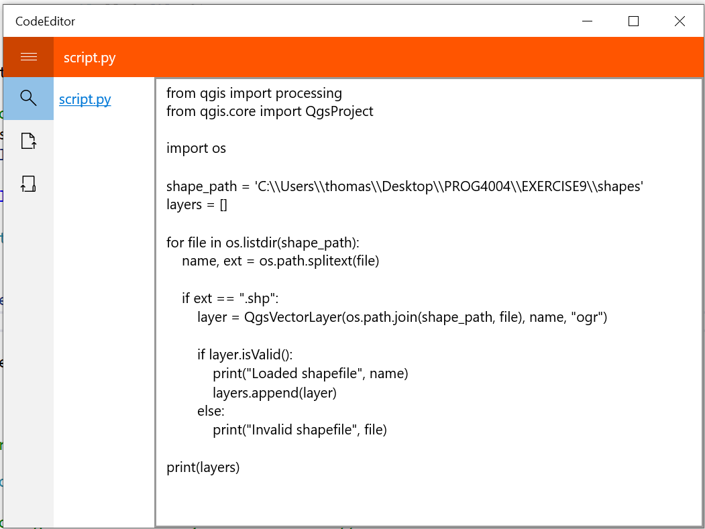

# UWP Code Editor

Editor made using the universal windows platform

Future fixes
 - Update color of save button to match the rest of the application
 - Remove / replace "Author" page (assignment required multi-pages)

**Notes:**
 - Application requires file-system permissions (to allow opening / saving files *anywhere*)

## Features

 - Hamburger menu
 - Load a single file
 - Load a folder to display all files in that folder
 - Edit individual files
 - Save individual files

## Output Image

